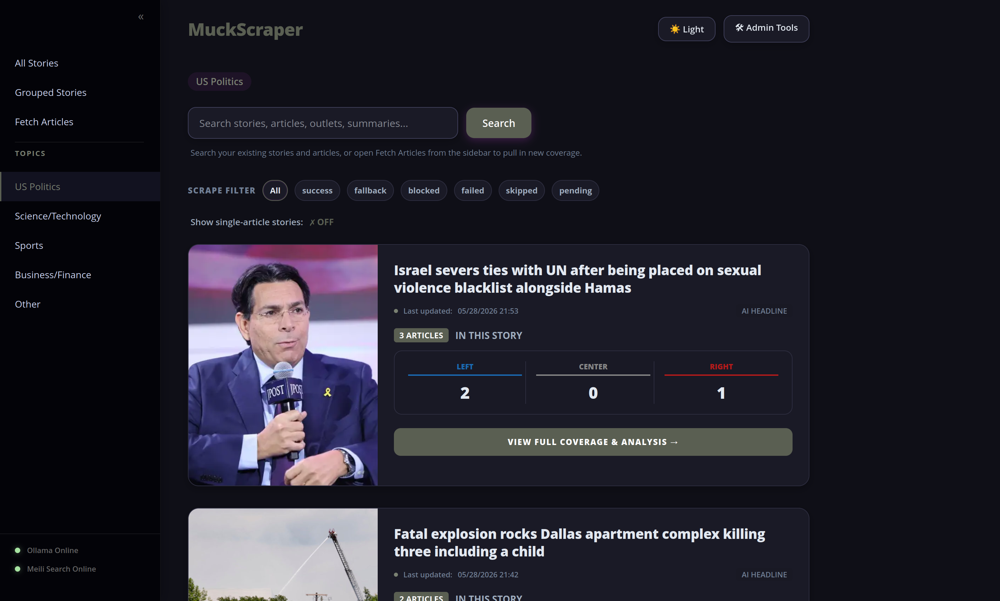
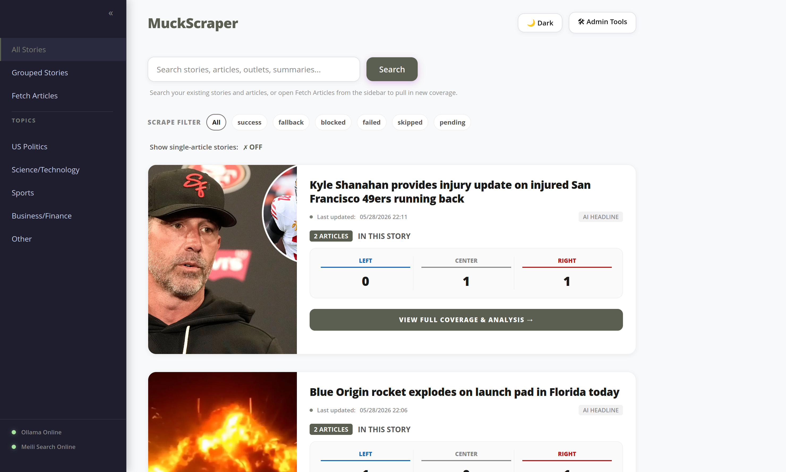

# MuckScraper — All the Muck That's Fit to Scrape
 
### A Self-Hosted News Aggregator with LLM Analysis
 
> **TL;DR:** MuckScraper pulls news from multiple sources, groups articles about the same story together using vector embeddings, scores every outlet for political bias, and gives you a Smart Brevity AI summary — all running on your own hardware with no subscriptions, no tracking, and no algorithm deciding what you see.
 
---
 
## Screenshots
<<<<<<< HEAD

### Dark Mode


### Multi-Source Story Analysis


### Articles Feed


=======
 
### Main Feed

 
### Dark Mode

 
### Multi-Source Story View

 
### Bias Tags

 
>>>>>>> c1df2e6 (Release 0.4.0)
### Article Reader

 
---
 
## Why This Is Different
 
Most news aggregators just show you a firehose of articles. MuckScraper does things no other self-hosted tool does:
 
**Cross-outlet story clustering** — Articles from CNN, Fox News, Reuters, and AP covering the same event are automatically grouped into a single story using vector embeddings and semantic similarity. See how different outlets cover the same story side by side.
 
**Get out of the echo chamber** — Every story shows you how outlets across the political spectrum are covering the same event. Bias ratings are displayed in plain words (Left, Center-Left, Center, Center-Right, Right) sourced from AllSides where available, and AI-assessed otherwise. Not to tell you who to trust — to remind you that every story is told from somewhere.
 
**Story-first organization** — Coverage is grouped into stories instead of left as a flat reverse-chronological feed, so you can follow an event across multiple outlets without manually piecing it together.
 
**Topic-aware deep reports** — Multi-source stories get in-depth analytical reports tailored to their topic: political stories get left/center/right framing analysis, science stories get findings and expert commentary, sports stories get recaps and standings context, and so on.
 
**Smart Brevity summaries** — Summaries follow the Axios Smart Brevity format: The big picture, Why it matters, What's happening, What's next.
 
**Runs on your hardware** — No cloud APIs, no subscription fees, no data leaving your machine. Ollama runs the LLMs locally. Everything else is Postgres and Python.
 
---
 
## What It Does
 
MuckScraper pulls news from multiple APIs across configurable topic categories on a scheduled basis. Articles are scraped for full text, classified into topics by an LLM, grouped into stories using vector similarity, scored for political bias, and surfaced via a clean web interface with dark mode support. Generate AI summaries on demand, read full scraped article text, and get deep multi-source analysis — all from your own server.
 
---
 
## Tech Stack
 
- **Backend:** Python, Flask, SQLAlchemy
- **Database:** PostgreSQL with pgvector
- **News Data:** NewsAPI + GNews (configurable)
- **LLM:** Any Ollama-compatible model, or adaptable to OpenAI/Anthropic APIs
- **Embeddings:** nomic-embed-text via Ollama
- **Scraping:** BeautifulSoup, Playwright, readability-lxml, archive.ph fallback
- **Observability:** Langfuse (optional)
- **Server:** Gunicorn
- **Containerization:** Docker, Docker Compose
---
 
## Project Structure
 
```
muckscraper/
├── aggregator/
│   ├── __init__.py                       # App factory
│   ├── app.py                            # Entry point
│   ├── models.py                         # Database models
│   ├── filters.py                        # Jinja2 template filters
│   ├── constants.py                      # Shared constants (TOPICS, AGGREGATORS)
<<<<<<< HEAD
│   └── blueprints/
│       ├── admin.py                      # Authenticated write/trigger routes
│       ├── auth.py                       # Login/logout routes
│       └── __init__.py
=======
│   ├── blueprints/
│   │   ├── admin.py                     # Authenticated write/trigger routes
│   │   ├── auth.py                      # Login/logout routes
│   │   ├── public.py                    # Reader and feed routes
│   │   └── __init__.py
│   ├── static/                          # Shared icons and UI assets
>>>>>>> c1df2e6 (Release 0.4.0)
│   └── templates/
│       ├── articles.html                 # Full feed with admin controls
│       ├── story.html                    # Multi-source story and deep report view
│       ├── article.html                  # Full article reader
│       ├── macros.html                   # Shared template helpers
│       ├── scrape_blocklist.html         # Blocked domains management
│       └── login.html                    # Authentication page
├── news_fetcher/
│   ├── fetch_and_store_articles.py       # Core ingestion + edition publishing logic
│   ├── allsides_lookup.py                # AllSides bias lookups
│   ├── headline_generator.py             # AI headline generation
│   ├── merge_outlets.py                  # Outlet normalization and deduplication
│   ├── rss_fetcher.py                    # RSS ingestion helpers
│   ├── scheduler.py                      # Scheduled fetch runner
│   ├── scraper.py                        # Web scraper with bad-scrape detection
│   ├── story_grouper.py                  # Vector embedding story clustering
│   ├── topic_classifier.py               # LLM topic classification
│   ├── summarizer.py                     # Smart Brevity summarization + deep reports
│   ├── outlet_bias_llm.py                # Political bias scoring
│   ├── backfill_images.py                # One-time image URL backfill utility
│   └── cleanup_duplicates.py             # Maintenance script
├── migrations/                           # Alembic migration files
├── create_admin.py                       # Admin user creation script
├── docker-compose.yml
├── Dockerfile
├── requirements.txt
├── .env.sample
├── restart.sh
└── README.md
```
 
---
 
## ⚠️ Security Warning
 
**Do not expose admin routes to the internet.**
 
Recommended deployment:
- Admin interface: local network only, or behind VPN (WireGuard, Tailscale)
---
 
## Requirements
 
- Docker and Docker Compose
- NewsAPI key (free tier: 100 requests/day)
- GNews API key (free tier: 100 requests/day)
- Ollama running on your network with:
  - A chat model (e.g. `llama3.1`, `mistral`)
  - An embedding model (`nomic-embed-text`)
- Langfuse instance (optional — for LLM observability)
---
 
## Installation
 
```bash
git clone https://github.com/grregis/muckscraper.git
cd muckscraper
cp .env.sample .env
# Edit .env with your API keys and Ollama host
docker compose up --build
# Create your admin user
docker compose exec app python create_admin.py
```
 
Then open `http://localhost:5000` in your browser.
 
---
 
## Current Features
 
### Edition System
- Four editions published daily (night, morning, afternoon, evening)
- 20 stories per edition
- No repeat stories between editions unless new articles have arrived
- Stories older than 3 days excluded from edition candidates
- Carried-over fallback stories capped at 48 hours old
- Database-level uniqueness constraint prevents duplicate stories within an edition
### News Fetching
- Scheduled fetching 4 times daily (12am, 7am, 12pm, 6pm Eastern) across 7 topic categories
- On-demand fetch via the web interface — by topic or custom search query
- Dual API sources — NewsAPI and GNews fetched for every topic
- Smart restart timer — skips fetch on startup if last fetch was recent
- Duplicate article detection by URL and title+outlet
- Source and title keyword blocklist
- Aggregator deduplication — Yahoo, Google News, MSN articles hidden when original source content exists
### Article Scraping
- Full article text scraped automatically on fetch
- BeautifulSoup + readability-lxml for content extraction
- Playwright fallback for JavaScript-heavy sites
- Googlebot user agent fallback for soft-paywalled sites
- archive.ph fallback as last resort
- Bad scrape detection — login walls, captchas, bot detection pages, and duplicate outlet content automatically detected and cleared
- Automatic domain blocklisting when bad scrapes are detected
- Pre-configured permanent blocklist for hard-paywalled domains
- Retroactive audit via admin UI
### Topic Classification
- LLM-powered topic classification by content
- Topics: US Headlines, US Politics, International Headlines, Science/Technology, Gaming, Sports, Business/Finance
- Articles can belong to multiple topics
### Political Bias Scoring
- Outlet-level bias scoring via LLM on a 1–5 scale
- Displayed in plain language: Left, Center-Left, Center, Center-Right, Right
- AI or AllSides source badge on every bias display
- Scores assigned automatically when a new outlet is first seen
- Outlet name normalization — feed title variants (e.g. "NPR Topics: News") cleaned to canonical names
- Duplicate outlet merging via admin menu — safely reassigns articles before deleting duplicates
### Story Grouping
- Vector embedding-based story clustering using pgvector and nomic-embed-text
- Embeddings generated from title + content snippet for richer semantic matching
- Video/media prefix stripping ("WATCH:", "VIDEO:", "LIVE:") before embedding to prevent prefix-driven similarity misses
- pgvector nearest-neighbour SQL search for re-grouping
- LLM disambiguation for borderline matches (threshold: 0.68–0.92)
- Unscraped single-article stories excluded from edition selection
- Stories ordered by most recent article date
### AI-Generated Story Headlines
- Wire service style, 15 words max, present tense active voice
- Generated automatically when a second article is added to a story
### LLM Summarization
- Smart Brevity story summaries: The big picture, Why it matters, What's happening, What's next
- Topic-aware deep reports for multi-source stories
- Per-article summaries in the article reader
- Auto-summarization when Ollama reconnects
- Langfuse tracing on all LLM calls (optional)
### Web Interface
- Full article reader with scraped HTML content
- On-demand Summarize and Deep Analyze buttons per article/story
- Dark/light mode with preference saved in browser
- Ollama online/offline status indicator
- Local timezone conversion for all article dates
- Authentication with login page and protected admin routes
### Maintenance (admin menu)
- ⚡ Wake Ollama — sends Wake on LAN magic packet
- ↻ Ollama Catchup — re-groups, re-rates, and re-summarizes missed content
- ↻ Scrape Missing — bulk re-scrapes articles missing full text
- ⚡ Force Re-group — rebuilds all story groupings from scratch (with confirmation)
- ↻ Reclassify Topics — reclassifies all articles
- 🔀 Merge Duplicate Outlets — normalizes outlet names and merges duplicates, safely reassigning all articles before deletion
- 🚫 Scrape Blocklist — view and manage blocked domains
- ⚡ Audit Bad Scrapes — scan all stored content for login walls and duplicates
---
 
## Customization
 
### Topics / Categories
Edit `TOPICS` in `aggregator/constants.py` and `SCHEDULED_FETCHES` in `news_fetcher/scheduler.py`.
 
### LLM Provider
LLM calls are isolated in: `outlet_bias_llm.py`, `summarizer.py`, `topic_classifier.py`, `story_grouper.py`, and `headline_generator.py`.
 
### Tunable Constants
| Constant | File | Default | Purpose |
|----------|------|---------|---------|
| `SIMILARITY_THRESHOLD` | `story_grouper.py` | `0.92` | Auto-match threshold — above this, no LLM confirmation needed |
| `LOWER_THRESHOLD` | `story_grouper.py` | `0.68` | LLM confirmation threshold — between this and 0.92, Ollama decides |
 
### Blocked Sources
Add domains or title keywords to `BLOCKED_SOURCES` and `BLOCKED_TITLE_KEYWORDS` in `news_fetcher/fetch_and_store_articles.py`. Scraper-level domain blocking is managed via the admin UI.
 
---
 
## Maintenance Scripts
 
| Script | Purpose |
|--------|---------|
| `./restart.sh` | Soft rebuild — clears cache, rebuilds images, keeps database |
| `create_admin.py` | Create or reset admin user credentials |
| `cleanup_duplicates.py` | Deduplicate articles by URL and title+outlet |
| `backfill_images.py` | Backfill image URLs from stored raw API payloads |
 
---
 
## Known Limitations
 
- Hard-paywalled sites (NYT, Washington Post, WSJ) cannot be fully scraped — pre-blocked
- Topic classification accuracy depends on LLM quality
- Story clustering quality depends on Ollama being online during fetches
- No mobile-responsive layout yet
---
 
## License
<<<<<<< HEAD

=======
 
>>>>>>> c1df2e6 (Release 0.4.0)
MIT License — see `LICENSE` for details.
